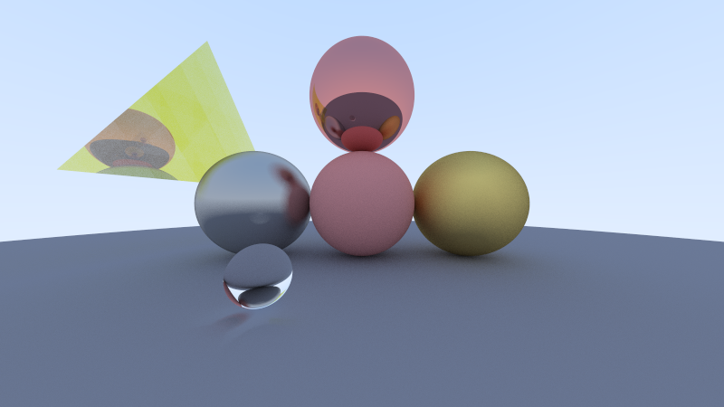
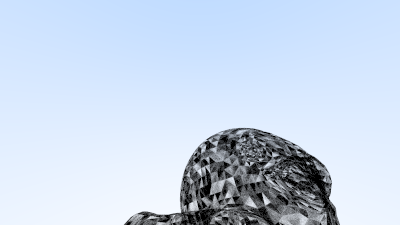

# Ray Tracing In Rust

This is an implementation of the [Ray Tracing in One Weekend](https://raytracing.github.io/books/RayTracingInOneWeekend.html) in rust. 

On top of the original tutorial, it does the following:
- Parallelization of rendering (across CPU cores using Rayon)
- Supports triangles and, subsequently, 3D models (currently buggy)

Some results:

This was an attempt at rendering a 3D model of a duck. It's a work in progress...